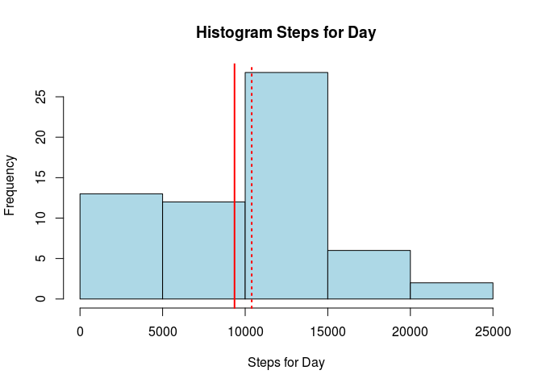
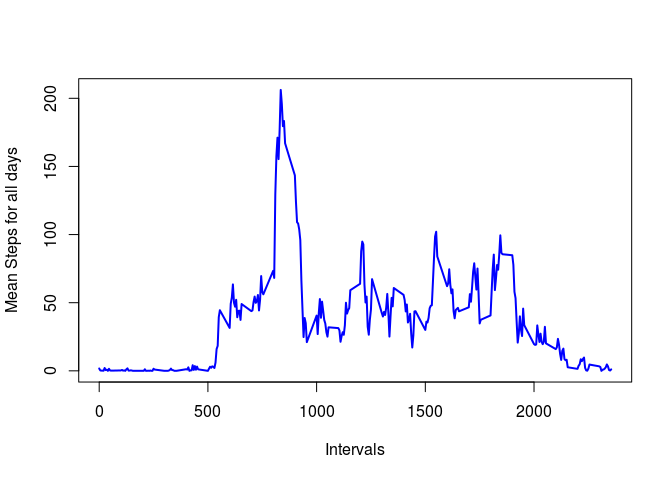
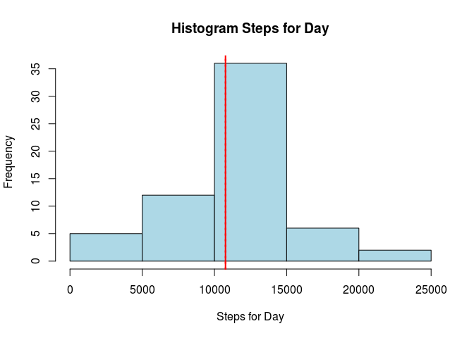

# Reproducible Research: Peer Assessment 1


## Loading and preprocessing the data

```r
data<-read.csv('~/coursera/Reproducible_Research/Assign_1/RepData_PeerAssessment1/activity.csv')
library(plyr)
stepsForDay <- ddply(data, 'date', summarise, N=sum(steps,na.rm=TRUE))
meanForInterval<-ddply(data, 'interval', summarise, meanSteps=mean(steps,na.rm=TRUE))
```

## What is mean total number of steps taken per day?


```r
mx <- mean(stepsForDay$N,na.rm=TRUE)
media <- median(stepsForDay$N,na.rm=TRUE)
hist(stepsForDay$N,col='lightblue',xlab='Steps for Day',main='Histogram Steps for Day')
abline(v = mx, col = "red", lwd = 2)
abline(v = media, col = "red", lwd = 2,lty=3)
```

 

The mean steps for day is 9354 and the median is 10395

## What is the average daily activity pattern?

```r
plot(meanForInterval$interval,meanForInterval$meanSteps,type='l',lwd=2,col='blue',xlab='Intervals',ylab='Mean Steps for all days')
```

 

```r
ind <- which.max(meanForInterval$meanSteps)
```

The 5-minute inerval 835 contains the maximum number of steps.

## Imputing missing values

```r
miss <- length(which(is.na(data$steps)))
```

The total number of missing data are 2304


```r
ix <- match(data[which(is.na(data$steps)),]$interval,meanForInterval$interval)
dataFilled<-data      
dataFilled[which(is.na(dataFilled$steps)),]$steps <- meanForInterval$meanSteps[ix]
stepsForDay2 <- ddply(dataFilled, 'date', summarise, N=sum(steps,na.rm=TRUE))

mx2 <- mean(stepsForDay2$N,na.rm=TRUE)
media2 <- median(stepsForDay2$N,na.rm=TRUE)
hist(stepsForDay2$N,col='lightblue',xlab='Steps for Day',main='Histogram Steps for Day')
abline(v = mx2, col = "red", lwd = 2)
abline(v = media2, col = "red", lwd = 2,lty=3)
```

 

The mean steps for day is 1.076619\times 10^{4} and the median is 1.0766189\times 10^{4}


## Are there differences in activity patterns between weekdays and weekends?


```r
dataFilled$date <- as.Date(dataFilled$date,format="%Y-%m-%d")
dow <- weekdays(dataFilled$date)
Encoding(dow) <- 'latin1'
dataFilled$TypeofDay<-NA
dataFilled$TypeofDay[which(dow%in%c('sábado','domingo'))]<-'weekend'
dataFilled$TypeofDay[which(is.na(dataFilled$TypeofDay))]<-'weekday'
dataFilled$TypeofDay<-as.factor(dataFilled$TypeofDay)
meanForInterval2<-ddply(dataFilled, c('TypeofDay','interval'), summarise, meanSteps=mean(steps,na.rm=TRUE))
library(lattice)
xyplot(meanSteps~interval|TypeofDay,meanForInterval2, layout=c(1,2),panel = panel.lines,ylab='Number of Steps',horizontal=FALSE)
```

 
